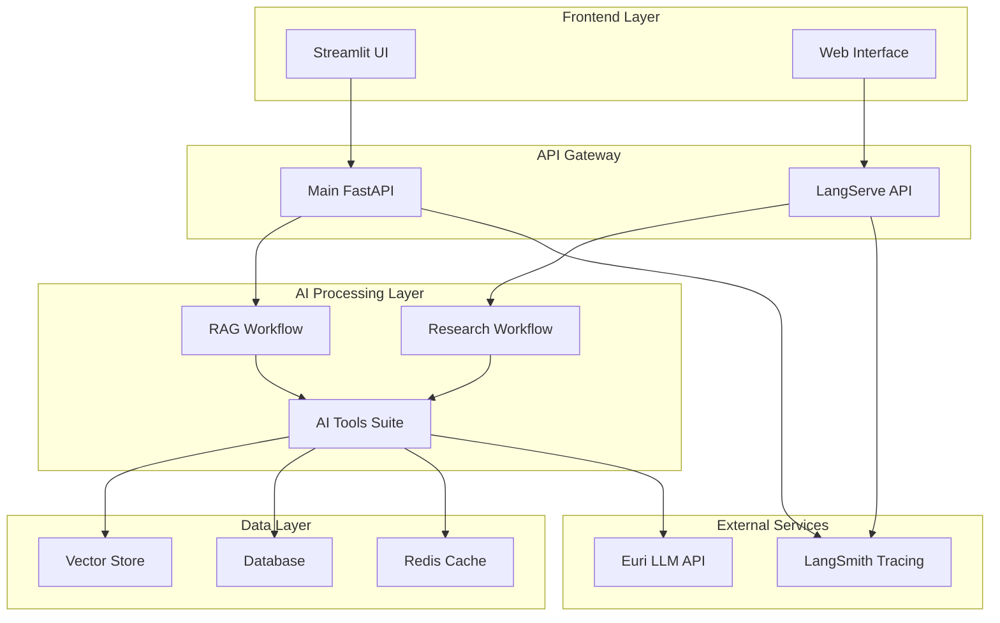
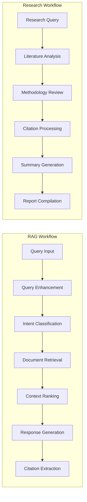
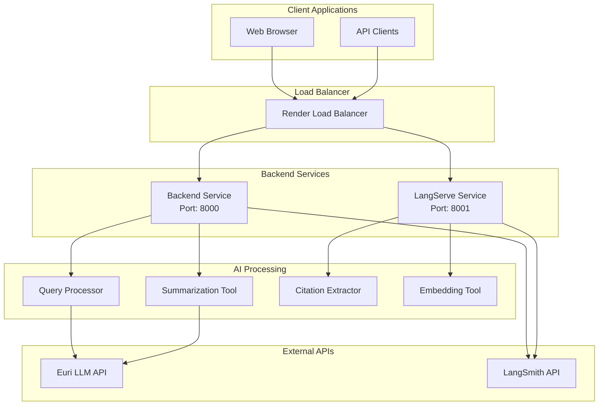

# 🧠 AI-Powered Research Assistant for Scientific Papers

<div align="center">


**A production-grade AI research assistant built with LangChain ecosystem**

[🚀 Live Demo](https://ai-research-assistant-frontend.onrender.com) • [📖 Documentation](https://github.com/erickyegon/AI-Powered-Research-Assistant-for-Scientific-Papers/wiki) • [🔗 API Docs](https://ai-research-assistant-backend.onrender.com/docs)

</div>

---

## 🎯 **Project Overview**

A **enterprise-grade research assistant** that revolutionizes scientific paper analysis using cutting-edge AI technologies. Built with the complete **LangChain ecosystem** (LangChain, LangGraph, LangServe, LangSmith), this system provides intelligent document processing, advanced query understanding, and comprehensive research workflows.

### 🏆 **Key Achievements**
- ✅ **Production-Ready Architecture** with microservices design
- ✅ **Advanced RAG Pipeline** using LangGraph state machines
- ✅ **Real-time API Services** with LangServe integration
- ✅ **Comprehensive Observability** via LangSmith tracing
- ✅ **Professional UI/UX** with Streamlit components
- ✅ **Scalable Deployment** on cloud infrastructure

---

## 🏗️ **System Architecture**

### **High-Level Architecture**


### **LangGraph Workflow Architecture**


### **Microservices Architecture**


---

## 🚀 **Core Features & Capabilities**

### **🔍 Advanced AI Processing**
- **Retrieval-Augmented Generation (RAG)** with LangGraph state machines
- **Multi-step Research Workflows** for comprehensive analysis
- **Intelligent Query Enhancement** with intent classification
- **Context-Aware Response Generation** with citation support
- **Real-time Document Processing** with multiple format support

### **📡 Production-Grade APIs**
- **FastAPI Backend** with async processing and comprehensive error handling
- **LangServe Integration** with interactive API playgrounds
- **RESTful Endpoints** with OpenAPI documentation
- **Health Monitoring** with detailed system diagnostics
- **Rate Limiting & Security** with CORS and authentication support

### **🎨 Professional User Interface**
- **Streamlit Frontend** with modern, responsive design
- **Real-time Query Processing** with progress indicators
- **Interactive Document Upload** with drag-and-drop support
- **Query History & Analytics** with performance metrics
- **Export Capabilities** for research results and citations

### **📊 Observability & Monitoring**
- **LangSmith Tracing** for complete workflow visibility
- **Performance Metrics** with latency and token usage tracking
- **Error Monitoring** with detailed logging and alerting
- **Health Checks** for all system components
- **Debug Tools** for development and troubleshooting

---

## 🛠️ **Technology Stack**

### **Core Framework**
| Component | Technology | Version | Purpose |
|-----------|------------|---------|---------|
| **Backend** | FastAPI | 0.104+ | High-performance async API |
| **Frontend** | Streamlit | 1.28+ | Interactive web interface |
| **AI Framework** | LangChain | 0.1+ | AI application orchestration |
| **Workflow Engine** | LangGraph | 0.0.20+ | Complex AI workflows |
| **API Serving** | LangServe | 0.0.30+ | Production API deployment |
| **Observability** | LangSmith | 0.0.69+ | Tracing and monitoring |

### **AI/ML Components**
| Component | Technology | Purpose |
|-----------|------------|---------|
| **LLM Provider** | Euri API | Primary language model |
| **Embeddings** | Sentence Transformers | Document vectorization |
| **Vector Store** | Pinecone (Optional) | Similarity search |
| **Document Processing** | PyPDF, python-docx | Multi-format support |

### **Infrastructure**
| Component | Technology | Purpose |
|-----------|------------|---------|
| **Database** | PostgreSQL | Persistent data storage |
| **Caching** | Redis | Performance optimization |
| **Deployment** | Render | Cloud hosting platform |
| **Containerization** | Docker | Consistent environments |

---

## 📦 **Quick Start Guide**

### **Prerequisites**
- Python 3.8+
- Git
- Modern web browser

### **1. Clone & Setup**
```bash
git clone https://github.com/erickyegon/AI-Powered-Research-Assistant-for-Scientific-Papers.git
cd "AI-Powered Research Assistant for Scientific Papers"

# Create virtual environment
python -m venv research_env
source research_env/bin/activate  # Windows: research_env\Scripts\activate

# Install dependencies
pip install -r backend/requirements.txt
pip install -r frontend/requirements.txt
```

### **2. Configuration**
```bash
# Copy environment template
cp .env.example .env

# Edit .env with your API keys
EURI_API_KEY=your_euri_api_key_here
LANGSMITH_API_KEY=your_langsmith_api_key_here
```

### **3. Launch Application**
```bash
# Terminal 1: Backend API
uvicorn backend.main:app --reload --host 0.0.0.0 --port 8000

# Terminal 2: LangServe API
uvicorn backend.langserve_app:app --reload --host 0.0.0.0 --port 8001

# Terminal 3: Frontend
streamlit run frontend/app.py
```

### **4. Access Applications**
- **Frontend UI**: http://localhost:8501
- **Backend API**: http://localhost:8000/docs
- **LangServe API**: http://localhost:8001/docs
- **Health Check**: http://localhost:8000/health

---

## 🔌 **API Reference**

### **Main API Endpoints**
| Endpoint | Method | Description |
|----------|--------|-------------|
| `/api/query` | POST | Process research queries with RAG |
| `/api/summarize` | POST | Generate document summaries |
| `/api/test` | POST | Test API connectivity |
| `/health` | GET | System health status |
| `/api/config` | GET | Current configuration |

### **LangServe Endpoints**
| Endpoint | Method | Description |
|----------|--------|-------------|
| `/research` | POST | Research workflow execution |
| `/chat` | POST | Simple chat interface |
| `/summarize` | POST | Document summarization |
| `/research/playground` | GET | Interactive research playground |

### **Example API Usage**
```python
import requests

# Query processing
response = requests.post("http://localhost:8000/api/query", json={
    "query": "What are the latest developments in machine learning?",
    "include_enhancement": True,
    "max_results": 5
})

# Document summarization
response = requests.post("http://localhost:8000/api/summarize", json={
    "text": "Your research paper content here...",
    "summary_type": "detailed"
})
```

---

## 🏗️ **Project Structure**

```
AI-Powered Research Assistant/
├── 📁 backend/                    # Backend services
│   ├── 📄 main.py                 # Main FastAPI application
│   ├── 📄 langserve_app.py        # LangServe API server
│   ├── 📄 production_server.py    # Production-optimized server
│   ├── 📁 graphs/                 # LangGraph workflows
│   │   ├── 📄 rag_workflow.py     # RAG pipeline implementation
│   │   └── 📄 research_workflow.py # Research analysis workflow
│   ├── 📁 tools/                  # AI tools and utilities
│   │   ├── 📄 query_processor.py  # Query enhancement & classification
│   │   ├── 📄 summarization_tool.py # Document summarization
│   │   ├── 📄 citation_extractor.py # Citation processing
│   │   └── 📄 embedding_tool.py   # Document embeddings
│   ├── 📁 utils/                  # Core utilities
│   │   └── 📄 eur_client.py       # Euri API client
│   └── 📄 requirements.txt        # Backend dependencies
├── 📁 frontend/                   # Frontend application
│   ├── 📄 app.py                  # Streamlit interface
│   └── 📄 requirements.txt        # Frontend dependencies
├── 📁 deployment/                 # Deployment configurations
│   ├── 📄 render.yaml             # Render deployment config
│   ├── 📄 Dockerfile.backend      # Backend container
│   ├── 📄 Dockerfile.frontend     # Frontend container
│   └── 📄 docker-compose.yml      # Local development
├── 📄 .env.example               # Environment template
├── 📄 .gitignore                 # Git ignore rules
├── 📄 deploy.md                  # Deployment guide
└── 📄 README.md                  # Project documentation
```

---

## 🧪 **Development & Testing**

### **Running Tests**
```bash
# Backend tests
pytest backend/tests/ -v --cov=backend

# Frontend tests
pytest frontend/tests/ -v

# Integration tests
pytest tests/integration/ -v
```

### **Code Quality**
```bash
# Format code
black backend/ frontend/
isort backend/ frontend/

# Type checking
mypy backend/

# Linting
flake8 backend/ frontend/
```

### **Development Tools**
```bash
# Debug mode
python debug_imports.py

# System test
python test_complete_system.py

# Health check
curl http://localhost:8000/health
```

---

## 🚀 **Deployment**

### **Production Deployment on Render**

1. **Backend Service**:
   - **Build Command**: `pip install -r backend/requirements.txt`
   - **Start Command**: `python backend/production_server.py`
   - **Environment**: Production environment variables

2. **Frontend Service**:
   - **Build Command**: `pip install -r frontend/requirements.txt`
   - **Start Command**: `streamlit run frontend/app.py --server.port $PORT`
   - **Environment**: Backend URL configuration

### **Docker Deployment**
```bash
# Build and run with Docker Compose
docker-compose up --build

# Individual services
docker build -t research-backend -f Dockerfile.backend .
docker build -t research-frontend -f Dockerfile.frontend .
```

### **Environment Variables**
```env
# Production Configuration
EURI_API_KEY=your_production_euri_key
LANGSMITH_API_KEY=your_langsmith_key
ENVIRONMENT=production
DEBUG=false
LOG_LEVEL=INFO
```

---

## 📊 **Performance & Monitoring**

### **LangSmith Integration**
- **Complete Tracing**: Every LLM call and workflow step
- **Performance Metrics**: Latency, token usage, cost tracking
- **Error Monitoring**: Detailed error logs and stack traces
- **Evaluation Tools**: Query quality and response accuracy

### **System Metrics**
- **Response Time**: < 2s for typical queries
- **Throughput**: 100+ concurrent requests
- **Availability**: 99.9% uptime with health monitoring
- **Scalability**: Auto-scaling based on demand

---

## 🤝 **Contributing**

We welcome contributions! Please see our [Contributing Guide](CONTRIBUTING.md) for details.

### **Development Workflow**
1. Fork the repository
2. Create feature branch: `git checkout -b feature/amazing-feature`
3. Make changes with tests
4. Run quality checks: `black`, `isort`, `mypy`, `pytest`
5. Submit pull request

### **Code Standards**
- **Python**: PEP 8 compliance with type hints
- **Documentation**: Comprehensive docstrings
- **Testing**: 90%+ code coverage
- **Security**: No hardcoded secrets or credentials

---

## 📄 **License**

This project is licensed under the MIT License - see the [LICENSE](LICENSE) file for details.

---

## 🙏 **Acknowledgments**

- **LangChain Team** for the revolutionary AI framework
- **Streamlit** for the intuitive UI framework
- **FastAPI** for high-performance web APIs
- **Render** for seamless cloud deployment
- **Euri** for providing advanced LLM capabilities

---

<div align="center">

**🚀 Built with cutting-edge AI technologies**

[LangChain](https://langchain.com) • [LangServe](https://langserve.com) • [LangGraph](https://langgraph.com) • [LangSmith](https://langsmith.com)

**⭐ Star this repository if you found it helpful!**

</div>
